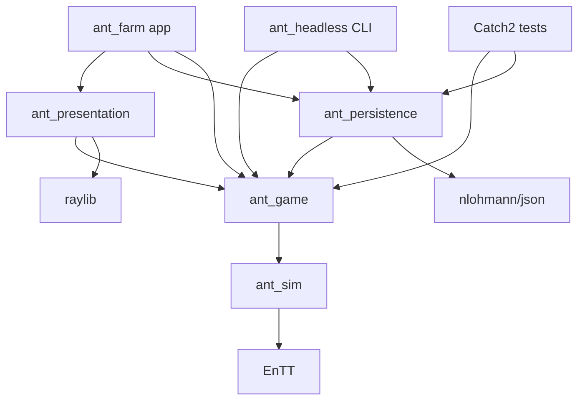

# Architecture and technology decisions

The module boundaries below are active contracts. Paths required through M1 exist; later-milestone paths remain proposed and should be created only when their backlog task requires them.

## Implemented through M1

`ant_sim` owns the seeded 384×216 grid, PCG32 state, navigation, EnTT entities, fixed 20 Hz step, reservations, cargo, sources, stores, and accounting. `ant_game` owns the session and read-only render view. `ant_presentation` owns raylib camera/input/drawing and cannot mutate the session. `ant_persistence` currently exposes only a capability marker so planned persistence is not mistaken for a save implementation. `ant_farm` owns the real-time accumulator; `ant_headless` runs finite deterministic simulations without raylib.

The M1 implementation keeps closely related code together (`world.cpp` contains the temporary guided forage systems, and `renderer.cpp` contains the first terrain/ant/HUD pass) instead of pre-creating speculative subsystem files. These split at the owning layer only when T005–T007 make the separation useful. On macOS, `app/macos_window.mm` is a narrow pre-window AppKit adapter for visible-frame sizing; it does not leak into sim, game, or presentation. Packaging an `.app` remains T016.

## Stack

| Concern | Decision | Reason / integration gate |
|---|---|---|
| Language | C++20, standard library, explicit RAII | Native performance; existing brief; avoid modules/coroutines until needed |
| Graphics/input | raylib, desktop GLFW/OpenGL route | Small 2D API; first prove macOS Retina window/camera in T002 |
| Entity storage | EnTT registry inside `sim` | Components without a custom ECS; never expose registry to UI or save format |
| Build | CMake >= 3.25, presets; Ninja preferred | Separate headless and desktop targets; Makefiles fallback documented if Ninja absent |
| Tests | Catch2 v3 + CTest | Behavior tests, filters, reproducible scenario harness |
| Content/save JSON | nlohmann/json | Named, versioned documents; validate before constructing runtime state |
| Debugging | Counters/overlays first; ImGui + rlImGui optional | Add only when it reduces development work; verify bridge compatibility separately |
| Terrain noise | Small deterministic hash-based variation | No noise dependency needed for layered 2D soil |
| Formatting | clang-format, repository-owned config | Add in M0; format owned source, not third-party code |
| Services | None | Local app, local profile, no credentials or network at runtime |

### Dependency selection procedure

The original brief's tags are historical examples, not tested pins. Upstream pages checked during planning on 2026-09-06 list raylib 6.0 and EnTT 4.0.0. This is not proof that every bridge/toolchain combination works. M0 selects a stable compatible release, resolves it to a full commit SHA (or release archive + SHA256), records version/revision/license in `docs/engineering/DEPENDENCIES.md`, and tests actual targets. Do not automatically choose a newer release on a future run.

Official references:

- [raylib releases](https://github.com/raysan5/raylib/releases) and [API reference](https://www.raylib.com/cheatsheet/cheatsheet.html).
- [EnTT releases](https://github.com/skypjack/entt/releases).
- [CMake FetchContent](https://cmake.org/cmake/help/latest/module/FetchContent.html): use immutable revisions, not moving branches.
- [nlohmann/json CMake integration](https://json.nlohmann.me/integration/cmake/) and [releases](https://github.com/nlohmann/json/releases).
- [Catch2 releases](https://github.com/catchorg/Catch2/releases).

These references establish integration options, not performance claims. Runtime configuration should never fetch dependencies or download content. Configure-time downloads are allowed; a warmed build must work without network access.

## Targets and allowed dependencies



`ant_sim`: grid, entities, RNG, scheduling, physical resource transfers, needs, life cycle. No JSON dependency.

`ant_game`: session/profile domain types, player commands, Work/Legacy, effective parameters, prestige readiness. May query sim and consume its tick events. No rendering, serialization, or wall clock.

`ant_persistence`: content parsing, profile serialization/migration, path selection and atomic replacement. Deserializes into validated domain DTOs; never calls rendering.

`ant_presentation`: renderer, player UI, read-only view snapshots. May depend on game API headers; cannot mutate session internals. Commands are submitted to app.

`app`: owns session, save service, rendering, and real-time accumulator. It commits candidate durable transitions through persistence before accepting them in the live session.

`ant_headless`: CLI for scripted commands, finite tick runs, invariants, statistics, benchmarks; no raylib link. Tests link libraries rather than shelling out except CLI integration tests.

## Proposed source layout

```text
CMakeLists.txt
CMakePresets.json
cmake/Dependencies.cmake
.clang-format
src/
  sim/
    types.hpp                  # EntityId, Tick, GridPos, resource units
    parameters.hpp             # Validated simulation parameter structs
    rng.hpp/.cpp               # Serialized PRNG streams + bounded sampling
    world.hpp/.cpp             # World state + step orchestration
    grid.hpp/.cpp              # Materials, passability, revisions
    components.hpp             # Physical entity components
    terrain_generation.cpp
    navigation.hpp/.cpp        # Home field, bounded target paths
    tasks.hpp/.cpp             # Stimuli, weighted response + commitment
    movement.cpp
    foraging.cpp
    excavation.cpp
    pheromones.hpp/.cpp
    brood.cpp
    metabolism.cpp
    death.cpp
    events.hpp                 # Typed per-tick results, not global event bus
  game/
    session.hpp/.cpp           # Owns run/meta, accepts commands
    commands.hpp               # Command and rejection/result variants
    progression.hpp/.cpp       # Run adaptations + Legacy tiers
    economy.hpp/.cpp           # Integer cost/payout functions
    view.hpp/.cpp              # Read-only display data + bottleneck diagnosis
    snapshot.hpp               # Stable serializable DTOs
  persistence/
    content_loader.hpp/.cpp
    profile_codec.hpp/.cpp
    migrations.hpp/.cpp
    save_service.hpp/.cpp
    platform_paths.hpp/.cpp
  presentation/
    renderer.hpp/.cpp
    terrain_renderer.cpp
    ant_renderer.cpp
    camera.hpp/.cpp
    ui.hpp/.cpp
    theme.hpp
    diagnostics.cpp
  app/main.cpp
  headless/main.cpp
assets/                        # Added with original/licensed assets only
config/balance.json            # Added with content-loading milestone
config/progression.json
tests/unit/
tests/scenarios/
tests/fixtures/
tools/verify.sh                 # Added when commands exist
.github/workflows/ci.yml
```

Use `ant::sim`, `ant::game`, `ant::persistence`, `ant::presentation` namespaces. Prefer `.hpp`/`.cpp`, `snake_case` files/functions, `PascalCase` types. Keep public APIs small. Systems can be functions taking explicit state; no base System class is needed.

## Principal contracts

Illustrative signatures, not source files to copy blindly:

```cpp
struct RunConfig { uint64_t seed; EffectiveParameters parameters; };
TickEvents sim::step(World& world); // exactly one fixed tick, no variable dt
World sim::make_world(const RunConfig& config);
CommandResult game::apply(Session& session, const Command& command);
GameView game::make_view(const Session& session); // read-only display model
ProfileSnapshot game::snapshot(const Session& session); // owning DTO
DecodeResult persistence::decode(std::string_view json);
SaveResult persistence::commit(const ProfileSnapshot& candidate);
```

`CommandResult` contains accepted/rejected and a stable reason enum. Commands include `SetFocus`, `BuyRunUpgrade`, `PrepareFlight`, `BuyLegacyTier`, `StartRun`, `AbandonRun`. Pause/speed are app controls; persist the selected speed as a setting, but load paused.

For durable boundary actions, app works on an owning candidate session/snapshot. Apply the command to the candidate, serialize/commit it, then swap the live state. Failure leaves the previous live state intact. Ordinary ticks and focus changes are not synchronously written to disk. Run-upgrade purchases become durable at the next save; Legacy/shop/reset transitions commit immediately.

A render view includes entity poses/cargo, visible terrain revisions, resource totals, counters, selection details, and validated action availability. Initially build a simple snapshot once per rendered frame; measure before adding caching. Terrain chunk uploads are revision-based, not a full terrain copy per frame.

## Memory, time, and identity

- `Tick` is uint64. One tick = 50 ms of simulation time. Parameter durations convert to whole ticks at content load, rejecting invalid/overflowed values.
- Resource values are int64 milli-units; Work/Legacy are integer int64. Validate maximums and use checked arithmetic.
- `EntityId` is monotonically increasing uint64, never reused within a run. Saved references use these IDs, with load-time resolution to EnTT handles.
- Position is fixed-point integer subcells (1/256 cell). Renderer converts to floating point and interpolates previous/current positions.
- A single simulation thread owns all writes. Start no worker pool until profiling proves a need and determinism is preserved.
- Derived navigation caches, spatial buckets, terrain textures, and UI state are rebuilt; scheduler phase follows saved tick, not local elapsed time.

## Explicit non-goals

No custom ECS, grain physics, full genetic model, universal save reflection, plugin system, hot reload framework, generational scripting language, or web frontend. A browser build can be assessed after the native loop is enjoyable; do not pay for that abstraction now.
